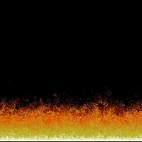

# Doom Fire SFML
## An implementation of Final Doom's fire animation built with C++ and SFML
- The algorithm is based on [this](https://fabiensanglard.net/doom_fire_psx/) amazing article by Fabien Sanglard

